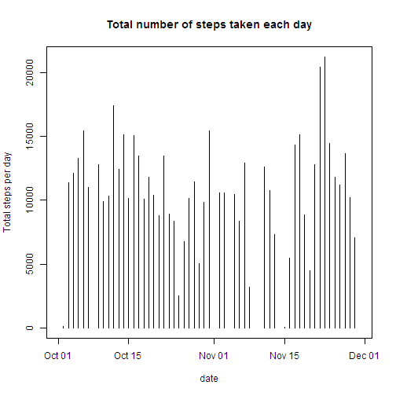
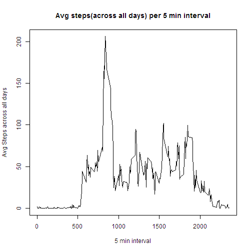
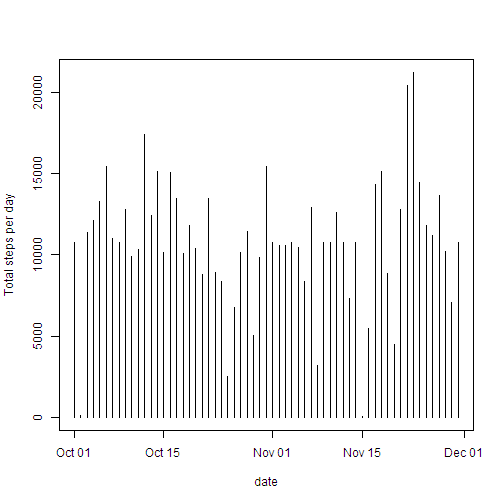
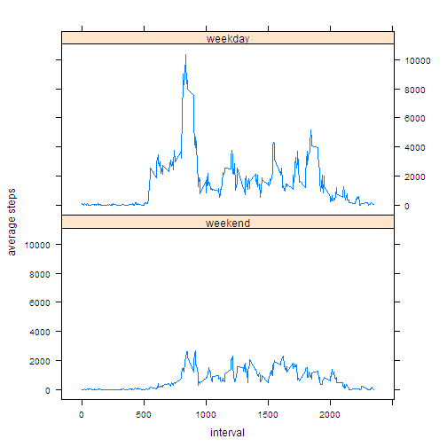

## Loading and preprocessing the data

```r
## Read File
amdata<-read.csv("activity.csv")
##Convert date to date type
amdata[,"date"]<-as.Date(amdata[,"date"],"%Y-%m-%d")
```

## What is mean total number of steps taken per day?
###Summarize data using doBy package to produce the histogram

```r
library("doBy")
##Use SummaryBy to get the total steps by day
sumbydayWithNA<-summaryBy(list(c("steps"),c("date")),amdata,FUN=c(sum))
##Change the column name
names(sumbydayWithNA)[2]<-"Total steps per day"
```

####1.Make a histogram of the total number of steps taken each day

```r
##Use the base plotting systemm to produce a histogram
plot(sumbydayWithNA,type="h",main="Total number of steps taken each day")
```

 


####2.Calculate and report the mean and median total number of steps taken per day, exclude NAs
##### Mean before imputation

```r
meanBeforeImpute<-round(mean(sumbydayWithNA[,"Total steps per day"],na.rm=T),2)
meanBeforeImpute
```

```
## [1] 10766.19
```
##### Median before imputation

```r
medianBeforeImpute<-round(median(sumbydayWithNA[,"Total steps per day"],na.rm=T),2)
medianBeforeImpute
```

```
## [1] 10765
```


## What is the average daily activity pattern?
####1.Make a time series plot of the 5-minute interval (x-axis) and the average number of steps taken, averaged across all days (y-axis)


```r
##calculate the average steps across all days for each 5 min interval using the summaryBy functuion in doBy package
avgsteps5minInterval<-summaryBy(list(c("steps"),c("interval")),amdata,FUN=c(mean),na.rm=T)
##generate a line plot
plot(avgsteps5minInterval,type="l",ylab="Avg Steps across all days",xlab="5 min interval", main="Avg steps(across all days) per 5 min interval")
```

 

####2.Which 5-minute interval, on average across all the days in the dataset, contains the maximum number of steps?

```r
##Use max function to find the 5-minute interval with maximum number of steps
subset(avgsteps5minInterval,avgsteps5minInterval$steps.mean==max(avgsteps5minInterval[,2]))[,"interval"]
```

```
## [1] 835
```

## Imputing missing values
####1.Calculate and report the total number of missing values in the dataset (i.e. the total number of rows with NAs)

```r
##use the is.na method to get subset of missing records
length(subset(amdata,is.na(amdata$steps))[,1])
```

```
## [1] 2304
```

####2.Devise a strategy for filling in all of the missing values in the dataset.
####Strategy: Make a copy of the exisiting data, indentify the observations with NA and substitute with respective 5 min interval averages

```r
##make copy of original data
amdataClean<-amdata

##Get Complete Cases
cc<-complete.cases(amdata)

##find matching averages based on interval
m<-match(amdataClean[!cc,"interval"],avgsteps5minInterval$interval)

##apply the averages to the data frame
amdataClean[!cc,1]<-avgsteps5minInterval[m,][,2]
```


####4.Make a histogram of the total number of steps taken each day and Calculate and report the mean and median total number of steps taken per day. Do these values differ from the estimates from the first part of the assignment? What is the impact of imputing missing data on the estimates of the total daily number of steps?

##### Histogram of the total number of steps taken each day

```r
##Use SummaryBy to get the total steps by day
sumbydayClean<-summaryBy(list(c("steps"),c("date")),amdataClean,FUN=c(sum))

##Change the column name
names(sumbydayClean)[2]<-"Total steps per day"

#What is mean total number of steps taken per day?
plot(sumbydayClean,type="h")
```

 


#####  Mean and median total number of steps taken per day after imputation
#####Mean After Imputation

```r
meanAfterImpute<-round(mean(sumbydayClean[,"Total steps per day"]),2)
meanAfterImpute
```

```
## [1] 10766.19
```

#####Median After Imputation

```r
medianAfterImpute<-round(median(sumbydayClean[,"Total steps per day"]),2)
medianAfterImpute
```

```
## [1] 10766.19
```

#### Compare before and After

```r
cdf<-data.frame(cbind(c("mean","median"),c(meanBeforeImpute,medianBeforeImpute),c(meanAfterImpute,medianAfterImpute)))
names(cdf)<-c("Measure", "Before Impute ", "After Impute")
cdf
```

```
##   Measure Before Impute  After Impute
## 1    mean       10766.19     10766.19
## 2  median          10765     10766.19
```

## Are there differences in activity patterns between weekdays and weekends?

####1. Add Weekday/Weekend factor

```r
## Create a new factor variable in the dataset with two levels – “weekday” and “weekend” indicating whether a given date is a weekday or weekend day.
amdataClean<-cbind(amdataClean,wkday=factor(as.POSIXlt(amdataClean$date)$wday %in% c(0,6),levels = c(TRUE,FALSE),labels=c("weekend","weekday")))

#Group data by interval,weekday
avgStepsByIntervalWkday<-summaryBy(list(c("steps"),c("interval","wkday")),amdataClean,FUN=c(sum))
```


####2.Make a panel plot containing a time series plot (i.e. type = "l") of the 5-minute interval (x-axis) and the average number of steps taken, averaged across all weekday days or weekend days (y-axis).

```r
## Use the lattice system make a plot
library(lattice)
xyplot(steps.sum~interval|wkday,data=avgStepsByIntervalWkday,type="l",layout=c(1,2),xlab="interval",ylab="average steps")
```

 
